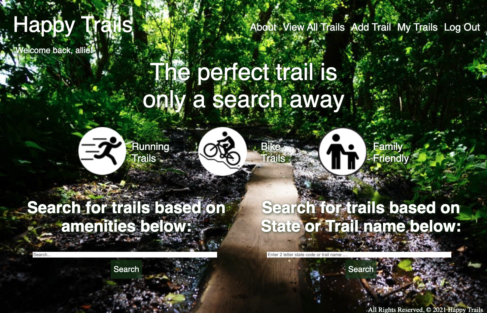
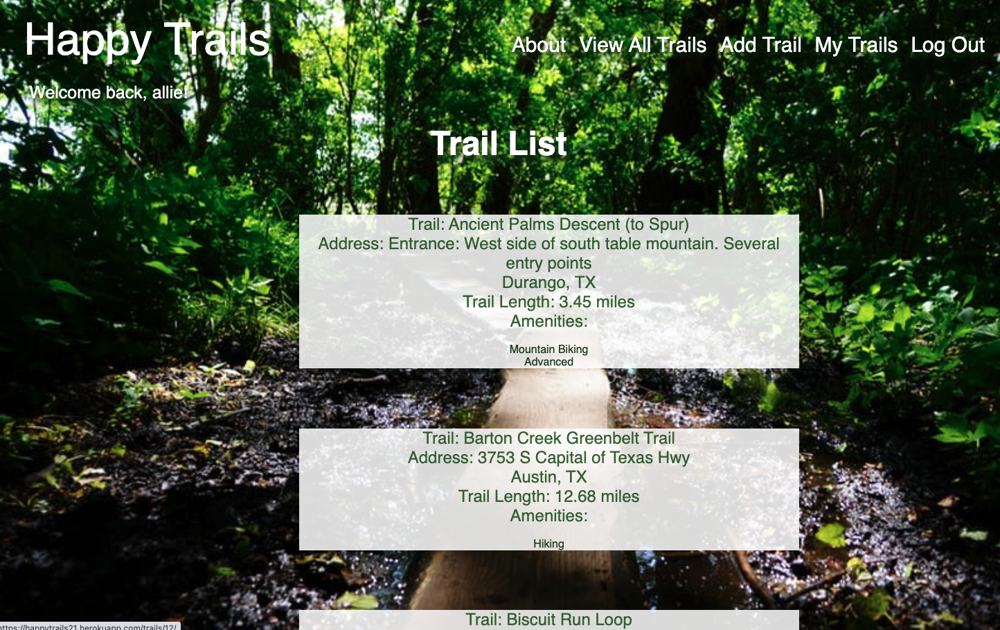
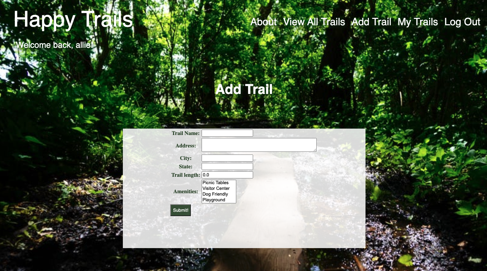
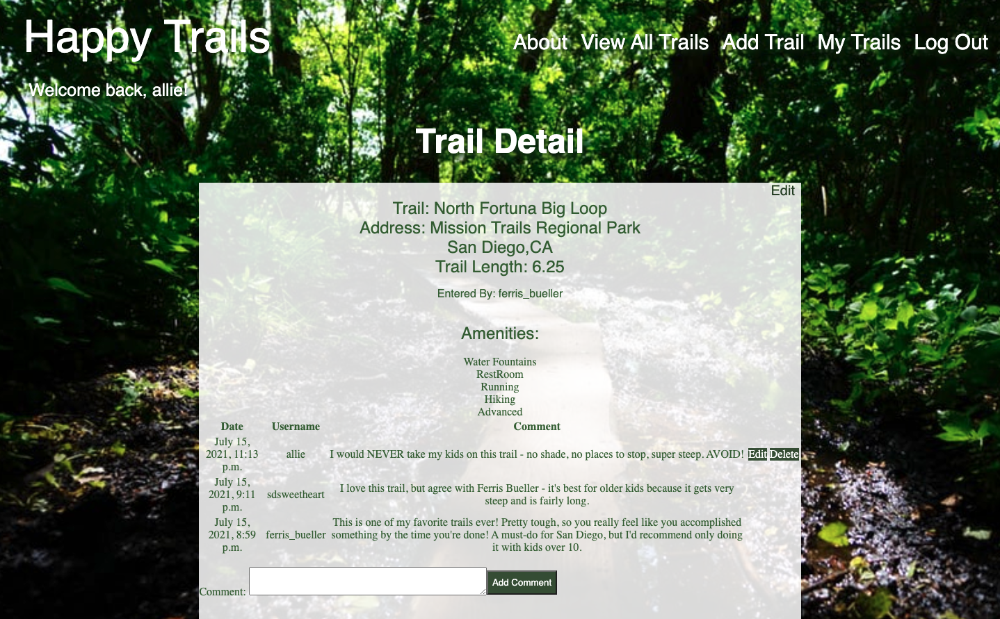

# Happy Trails
While many parents would like to share their love of the outdoors with their children, many are hesitant to venture out into parks and natural areas without an understanding of whether there are restrooms, benches, picnic areas, and other amenities that make a place family-friendly. 

Happy Trails is an app that helps parents spend less time on research and more time out on the trails. From the homepage, users can view a list of trails and search for trails based on amenities and by location. After creating an account, users can see trail details, add new trails to the database, update information about trails, comment on trails to let others know what to expect, and access a list of their trails. 

## Screenshots

---

---

## Technologies Used
* Python3/HTML/CSS
* Django
* PostgreSQL
* Heroku

## Our Team
* Allie Delano Bateman: Product Manager & Lead Developer
* Shannon Hensley: UX & Design
* Adam Wojdyla: GitHub Manager & Lead Developer

## Getting Started
Check out Happy Trails here: [Happy Trails](https://happytrails21.herokuapp.com/)

Our team used a Trello board to organize development of this app, from planning through deployment: [Happy Trails Team Trello Board](https://trello.com/b/9obyKpm9/happy-trails)

Check out our Pitch Deck here: [Happy Trails Pitch Deck](https://docs.google.com/presentation/d/1YkLuxJngkP_M9VpIZ9_eQM3AJBxzlK8utXBn_WH3dis/edit?usp=sharing)

## Future Features
* Icons for each amenity, instead of a list
* Search based on location and multiple amenities
* A favorites page and the ability to bookmark a trail as a favorite
* Ability to add photos to comments 
* Map integration to show locations